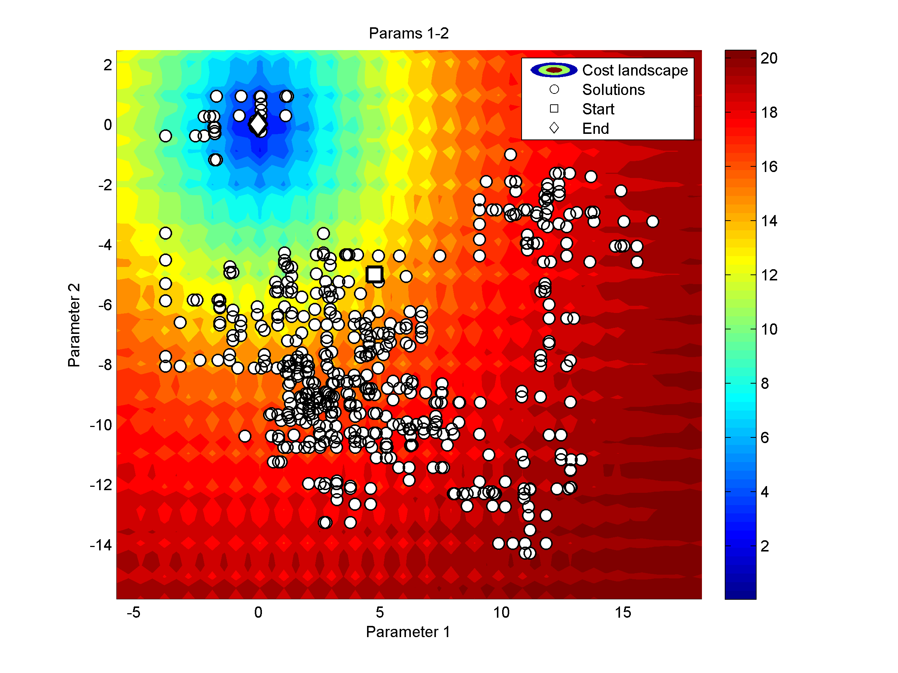
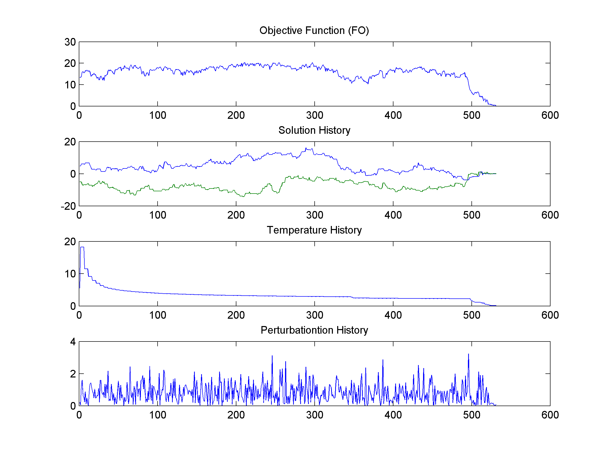
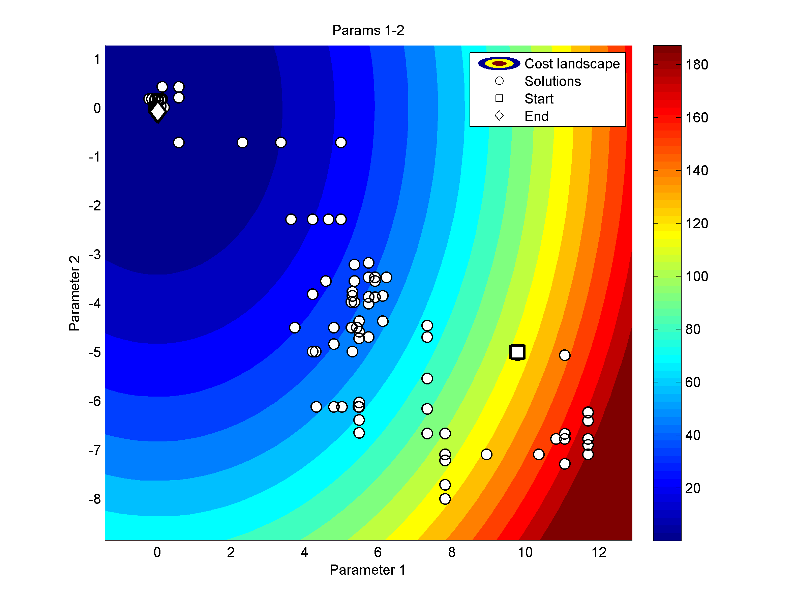
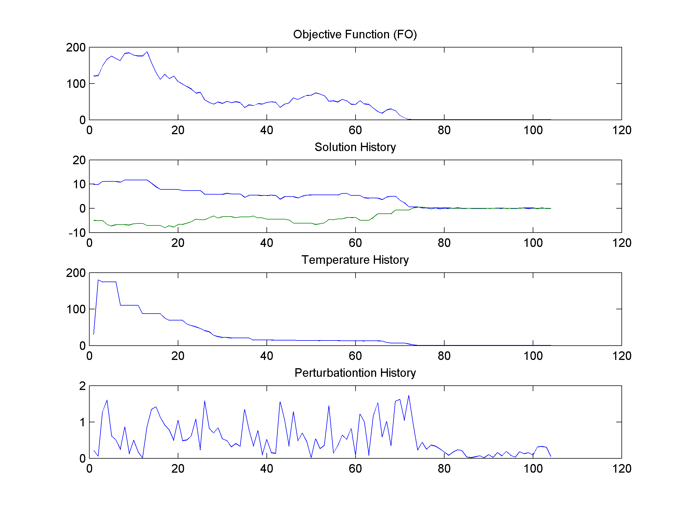

# Simulated Annealing Initialization Tool

This repository provides a set of MATLAB functions designed to assist in the initialization of **Simulated Annealing (SA)** algorithms by calculating a suitable starting temperature `T₀`. This is crucial for tuning the algorithm to effectively explore the search space and avoid premature convergence.


<p align="center">
  
  
</p>

<p align="center">
  
  
</p>

## What is Simulated Annealing?

Simulated Annealing is a probabilistic optimization algorithm inspired by the physical annealing process in metallurgy. It is designed to find the global minimum of a cost (objective) function by probabilistically accepting both better and worse solutions during its iterative process. The algorithm gradually reduces the probability of accepting worse solutions over time by decreasing the "temperature" parameter.

At high temperatures, the algorithm explores widely, potentially escaping local minima. As the temperature lowers, the search becomes more refined, converging toward a minimum. Choosing a proper initial temperature `T₀` is critical to balance exploration and exploitation effectively.

---

## Purpose of this Tool

This tool helps determine a suitable starting temperature `T₀` based on a typical cost difference (`ΔE`) and an initial acceptance probability (`E₀`) using the formula:

```
T₀ = -ΔE / log(E₀)
```

This formula allows you to set how likely the algorithm should be to accept worse solutions at the beginning of the optimization process.

---

## File Descriptions

- **`calculate_T0.m`**  
  **Input:**  
  - `DELTA_E`: A typical or estimated cost (energy) increase between two candidate solutions.  
  - `E0`: A desired initial probability of accepting a worse solution.  

  **Output:**  
  - `T0`: The calculated starting temperature.  

  ```matlab
  T0 = calculate_T0(DELTA_E, E0)
  ```

- **`E0_function.m`**  
  A sample function used to compute the initial acceptance metric `E₀`.  
  **Input:** A vector `x`.  
  **Output:** The maximum value in `x` (used as a proxy for E₀).  

  ```matlab
  E0 = E0_function(x)
  ```

- **`griewank_function.m`**  
  A widely used test function for optimization. The **Griewank function** has a known global minimum at `x = [0, 0, ..., 0]`, where the function evaluates to 0.  
  **Input:** A numeric vector `x`.  
  **Output:** The function value at `x`.  

  ```matlab
  f = griewank_function(x)
  ```

---

## Example Usage

```matlab
% Example input vector for evaluation
x = rand(1, 10); % Random 10-dimensional vector

% Step 1: Compute E0 using the E0 metric
E0 = E0_function(x);

% Step 2: Define a typical energy difference (e.g., estimated from samples)
DELTA_E = 10;

% Step 3: Calculate initial temperature
T0 = calculate_T0(DELTA_E, E0);

% Step 4: Optionally evaluate the objective function
fitness = griewank_function(x);

% Display results
fprintf('E0 = %.4f, T0 = %.4f, Fitness = %.4f\n', E0, T0, fitness);
```

---

## Requirements

- **MATLAB R2013a** or later (developed and tested on R2013a)

---

## License

This project is provided for educational and research purposes. No specific license has been applied.
